We declare that any and all AI usage within the project has been recorded and noted below.
We understand that failing to divulge use of AI within our work counts as contract cheating and can result in a zero mark for SEP.

## Project AI

### 1. Debugging

When faced with error messages we didn't understand or error messages that were hard to read:

&nbsp;- We put error messages into ChatGPT to explain them 

&nbsp;- We asked for possible fixes to the error

This would help us pinpoint errors in our code that we could fix.

### 2. Ideas for tests

When writing tests we didn't know where to start so we asked for possible areas of our code to test.

We asked what should be in our tests and to give examples of test code.

This helped us to write our own tests.

## Personal AI

### Niyor Gogoi:
I, Niyor Gogoi, declare that this document is accurate to my AI usage throughout the course of SEP.

#### Development
When I wasn't able to find the solution for how to do something by searching online, I asked ChatGPT for ideas.
I wasn't able to find how I could position widgets on the top app bar, so I asked:
How would I make an image centered an icon button be on the left for an AppBar in dart?
Here are some of the other prompts I have used:
What are the possible methods of implementing notifications into my app that uses flutter and apringboot?
How would I add a date picker in my calendar page?

#### Debugging
When I couldn't understand an error message and couldn't find it on the internet I used ChatGPT to exlain the issue.
I couldn't understand an error message relating to BuildContext on Flutter. 

**This was my prompt:**

'what does this mean? ''
Analyzing `guthealth_app`... info 
+ Don't use 'BuildContext's across async gaps lib/screens/survey_screen.dart:228:34 use_build_context_synchronously 1 issue found. (ran in 14.0s) Error: Process completed with exit code 1.

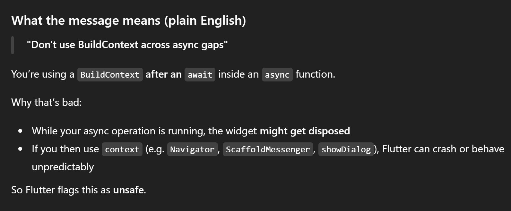
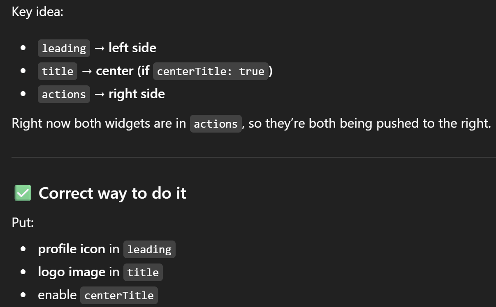
**Here are some of the other prompts I have used:**

+ _I am using a Pixel 9a emulator and my flutter app won't display as it says:_ 
+ I/Choreographer(30737): Skipped 184 frames! The application may be doing too much work on its main thread.
I/e.guthealth_app(30737): AssetManager2(0x7ebc8ecfa998) locale list changing from [] to [en-US]
Why am I getting an error where it says pixels overflow in my flutter app?;

### Ananyalakshmi Srinivasan

I used ChatGPT to help choose between the Springboot testing configurations before settling on the Mockito Series with JUnit. I found this to be the best option because it works very well for unit testing entities by injecting mock beans. I used this on the 18-19/11/2025 to figure out the best way to test our Springboot application before the MVP release. 

#### Fixing AWS database connection bug

Our AWS database wasn't publically discoverable. I checked several different AWS support documents and fixed issues such as setting database to publically accessible, ensuring security groups had  the necessary inbound and outbound port rules. However, the database was still not discoverable. Hence I used Google's AI overview to get some next steps: 
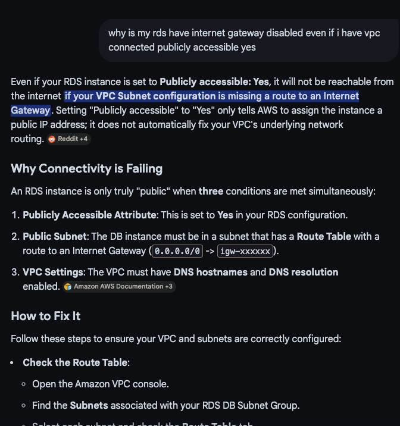

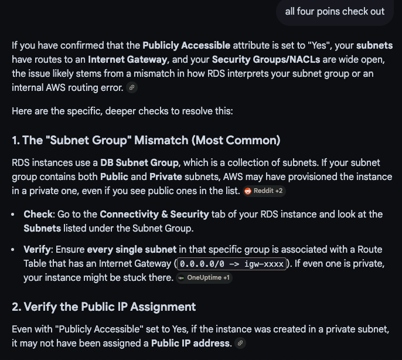 
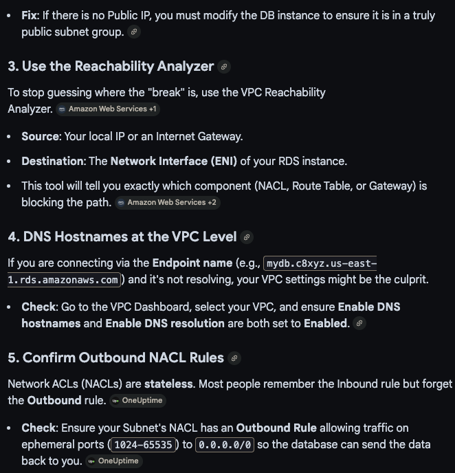 
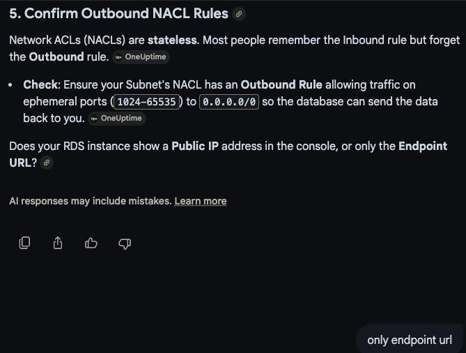 
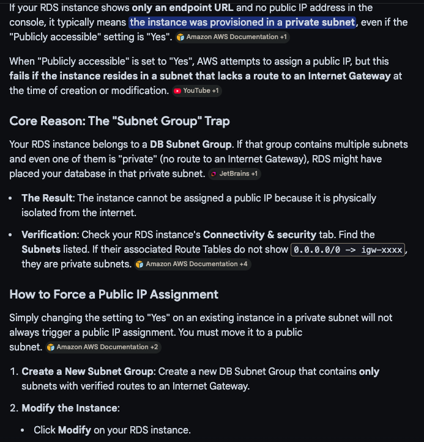
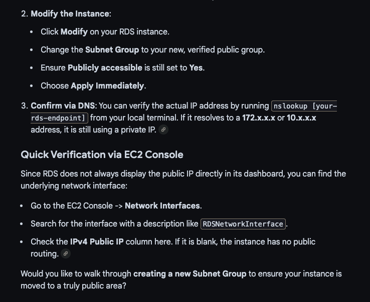
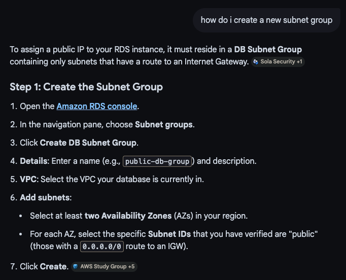

I used Blackbox AI to find the error in the **pg_hba.conf file** for aws database setup. 
Turns out the issue was that the change I'd made was commented still out. Here's the screenshot

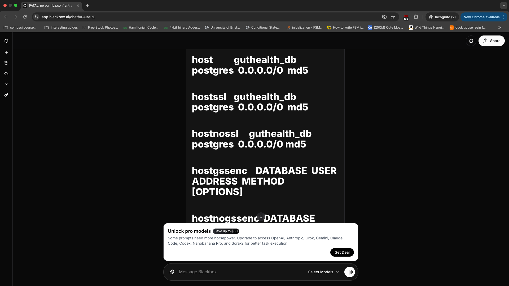
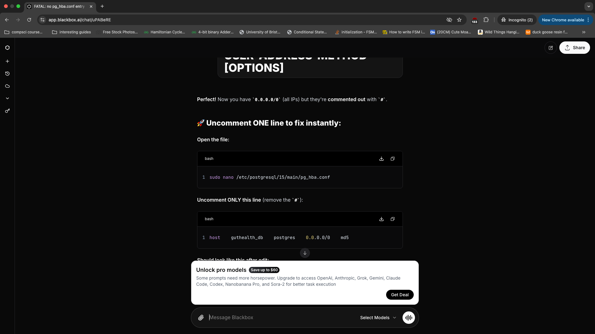

#### Fixing jar package build failure

I used Blackbox AI to confirm that the compiled jar package would not run correctly because environment variables were not being read.
It provided me with this update for my pom file. Once I added it the jar file generated builds correctly.

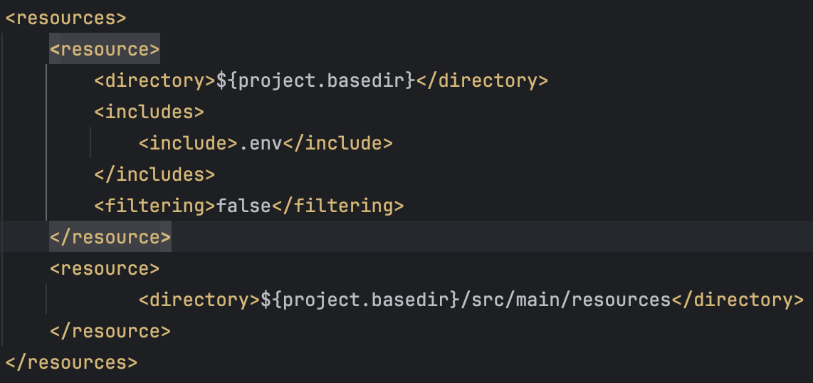

### Yuan Liu
#### Development (UI&feature decisions)

I used ChatGPT to explore implementation options and compare trade-offs before coding.
For example, I asked about two approaches for displaying emojis in a Flutter page:
1. using an emoji picker package
2. defining and rendering a custom emoji list

I also asked about the pros and cons of using third-party plugins versus implementing the emoji list myself for learning purposes. This helped me compare the options before making my own implementation decision. I used ChatGPT as a reference point, but I also reviewed similar projects and then chose the final approach myself.

I also asked ChatGPT how to generate a Gantt chart for our project plan and which tools would be most suitable for our needs. This helped me choose an appropriate tool and then create the timeline independently.

In addition, I used ChatGPT to understand GitHub workflows and project tooling, for example when I needed to check when a specific section had been added to a file and how to use file history or blame to trace that change.

#### Communication
I used ChatGPT to improve the clarity and tone of English messages for project communication because English is not my first language. I also used it to translate prompts, notes, and short pieces of documentation from Chinese into English when preparing project materials.

#### Debugging
When I encountered errors that were unclear or hard to resolve through documentation, I pasted the error message into ChatGPT and asked for an explanation and possible causes. I used it to help interpret the message, narrow down likely causes, and identify what I should check next in the codebase or environment.

Examples of this use include the following cases:

I usually use ai by Chinese, so I will explain what I asked and what I get helped from ai in follow example

**1. database duplicate email error**

I asked ai to explain a signup failure caused by a duplicate email address. The prompt I use basically is just send the error screenshot and ask why this shows error. The backend returned a database unique-constraint error, and ChatGPT helped me identify that the issue was caused by reusing an email address that already existed in the database.

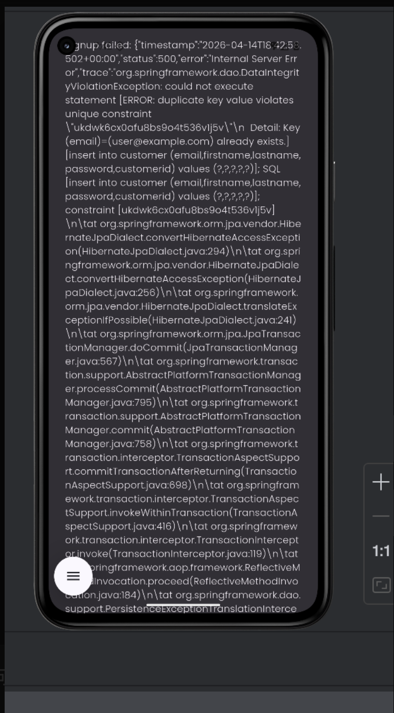
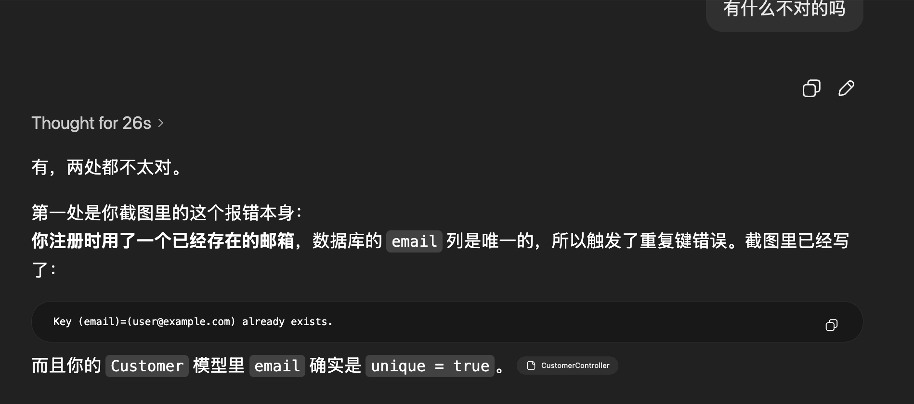

**2. forgot-password flow and ux decision**

I asked whether the forgot password screen needed to change when the backend returned only a success message. The prompt I use is just how's the common sense for forgot password flow. ai helped me compare different ux options and understand that returning the user to the login screen after a successful password reset was a reasonable design choice.

**3. postgresql connection timeout**

I pasted a postsql connection timeout log into chatgpt so I could understand why the backend was not starting correctly. I just paste the error message and ask why this cannot connected. This helped me identify that the failure was caused by the application being unable to open the connection to the database.

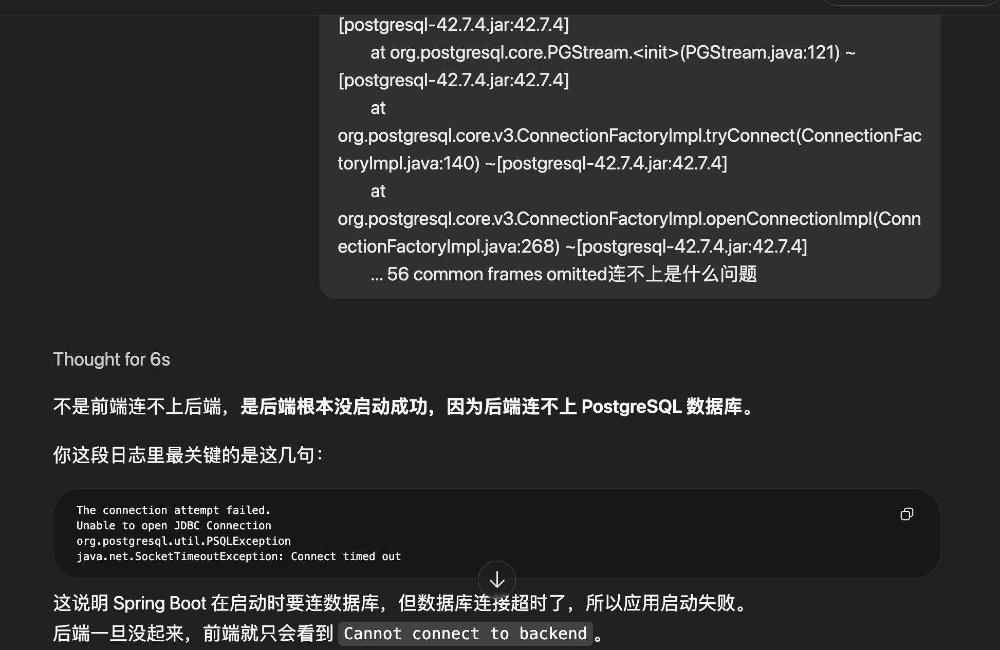

**4. flutter widget test failure**

I asked chatgpt to help interpret a failing Flutter widget test. It helped me identify that the mocked login response no longer matched the real response structure expected by the app, which explained why the login test was failing.

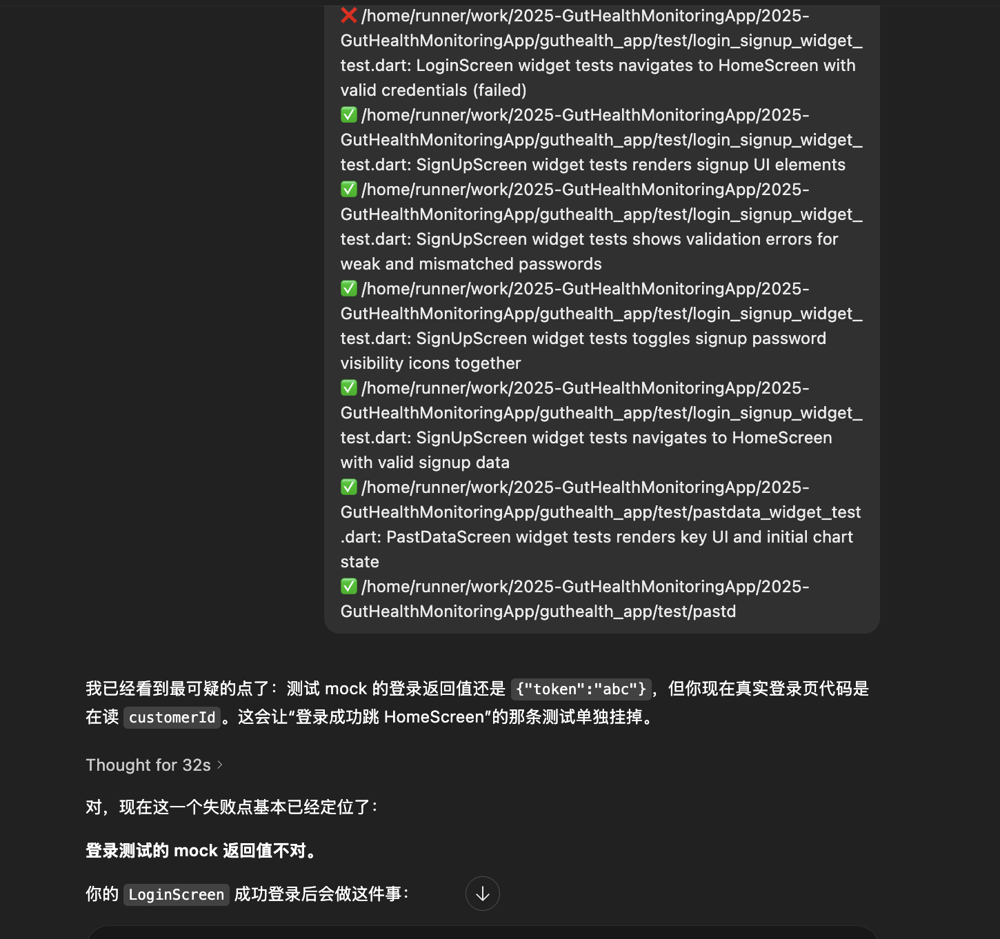

**5. backend ci compilation failure**

I used chatgpt to explain a backend CI compilation failure in CustomerController, including an undefined variable and a mismatch between the code being compiled and the expected response structure. This helped me understand what needed to be checked in the backend implementation. I paste the error message to ai.

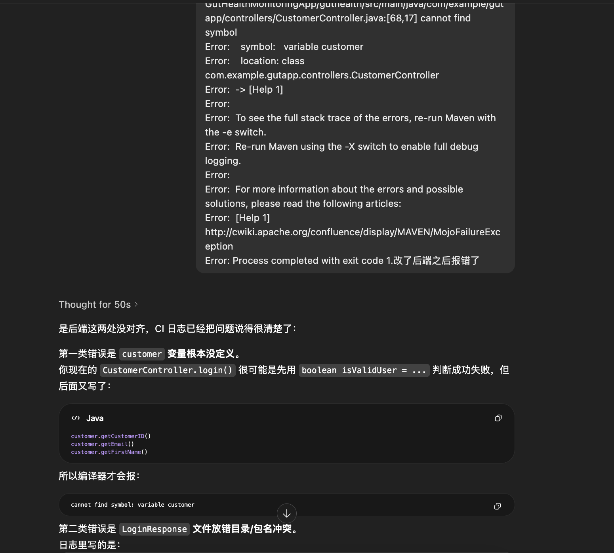

**6. github blame**

I also asked chatgpt how to use github blame and file history to trace when a specific line or block of code had been added. This helped me understand how to investigate change history in the repository. I ask how do I find who write the specific line in github.

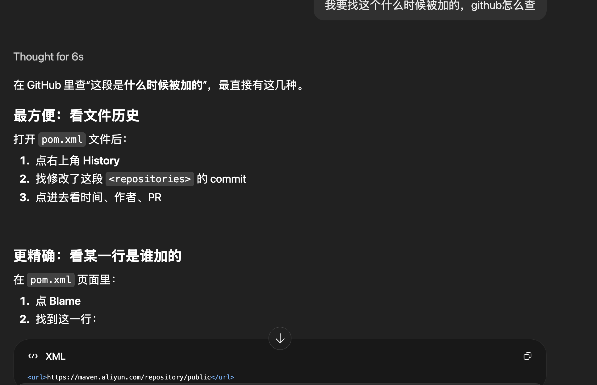

### Lingyi Lu  

#### Mood log search bar and emojis
During the development of the mood log feature, I used ChatGPT to explore different interface and interaction design approaches before implementation. I asked about several ways to select emotions, such as using an emoji grid, sliders, or label-based selection. ChatGPT helped me compare these options in terms of usability and implementation complexity.
I also discussed how to implement an emoji search list with labels and whether it would be better to use a third-party plugin or implement it myself. Based on these discussions, I ultimately chose to implement a simple emoji list myself to better understand the logic and data structure behind the feature.
Additionally, I consulted ChatGPT on how to handle search input and the placement of the search bar in the interface. I used these suggestions as references, while also reviewing design approaches from similar apps, and then made my own implementation decisions based on the actual situation.  

#### Backend structure
Backend Structural Mapping: I consulted AI to gain a deeper understanding of the Spring Boot layered architecture (Controller-Service-Repository).
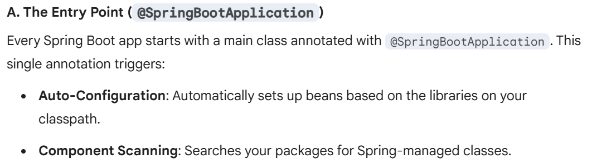
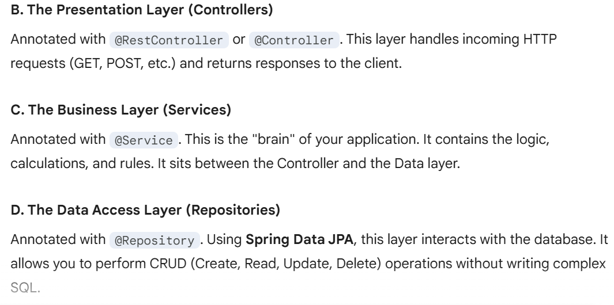
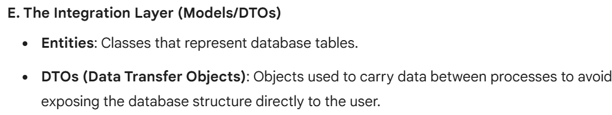

#### Data Exporting
I leveraged AI to design a robust algorithm for converting unstructured JSONB data into structured CSV reports. AI provided the logic for dynamic header discovery and ensured Excel compatibility (e.g., adding BOM for character encoding).
Edge Case Handling: AI assisted in writing sanitization logic to handle nested quotes within JSON strings, preventing data corruption during the export process.
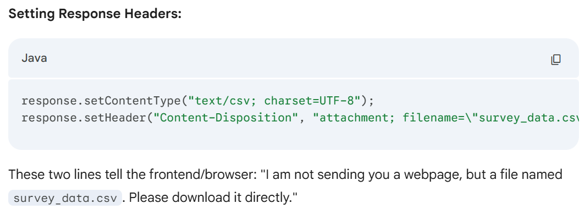    
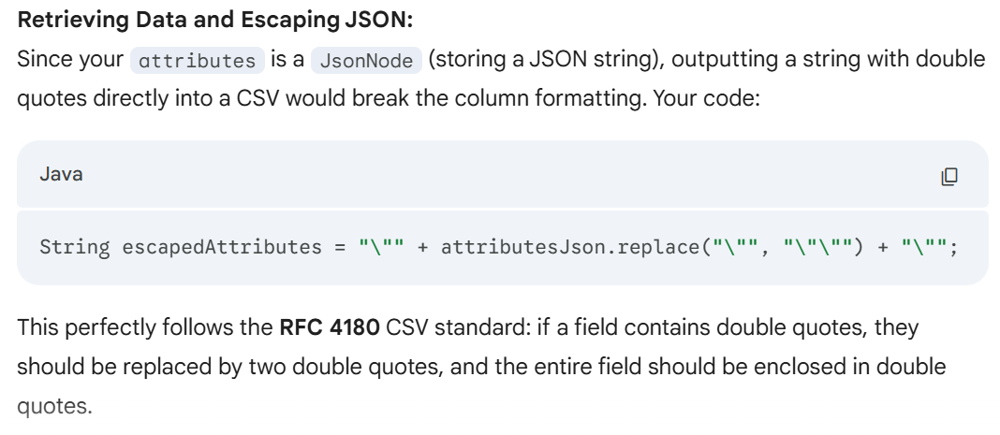

#### Explain the error messages
While working on the mood log feature, I sometimes ran into errors or UI behaviors that I didn’t fully understand, especially with the search bar and emoji results. In those cases, I used ChatGPT to explain the error messages and suggest possible reasons. For example, when the search results were not updating correctly or the layout in the AppBar overflowed on smaller screens, I asked ChatGPT what might be causing the issue.  
