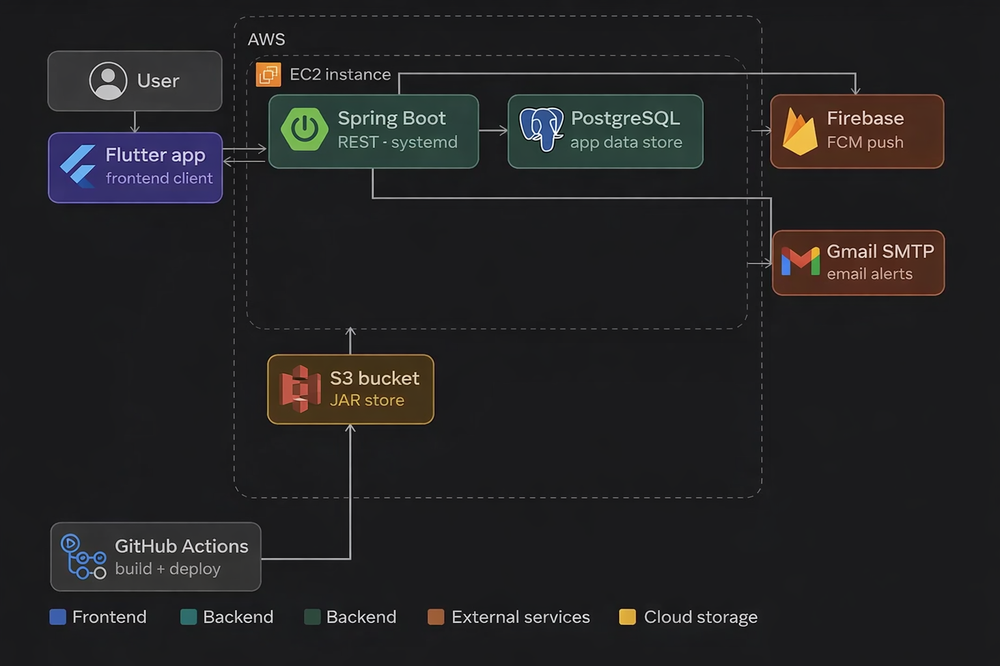
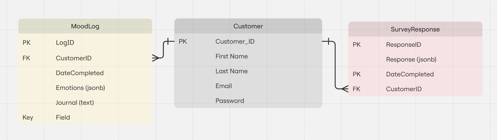
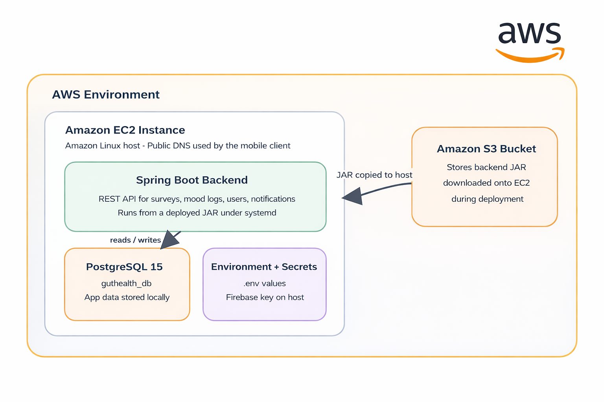

# Handover Documentation

## Contents

+ [Introduction](#introduction)

+ [Build and Execution](#build-and-execution)
  + [Prerequisites](#prerequisites)
  + [Environmental Variable Setup](#environmental-variable-setup)
  + [Running Frontend and Backend locally](#running-frontend-and-backend-locally)

+ [System Architecture](#system-architecture)

+ [Project Structure](#project-structure)

+ [Feature Overview](#feature-overview)
  + [Symptom Log Feature](#survey-feature---log-symptoms)
  + [Mood Log Feature](#mood-log-feature)

+ [Database Structure](#database-structure)

+ [AWS Setup](#aws-setup)

+ [Next Steps](#bugs-to-fix)
  + [Finish Off](#what-needs-to-be-finished)
  + [Additional Features](#additional-features)

+ [Further Documentation](#further-documentation)

+ [Who Can Help?](#who-can-help?)

## <a id="introduction"></a>Introduction

This document serves as a guide for any new developers who wish to begin work on this project.

The installation guide and user guide to test our app can be found here: [Installation Guide and User Instruction](installation_guide_and_user_instructions.md)

## <a id="build-and-execution"></a>Build and Execution 

### Quick Links

+ [Prerequisites](#prerequisites)
+ [Environmental Variable Setup](#environmental-variable-setup)
+ [Running frontend and backend locally](#running-frontend-and-backend-locally)

### <a id="prerequisites"></a>Prerequisites 
#### <ins> Frontend - Flutter </ins>

To work on the Flutter client in `guthealth_app/`, make sure the following are installed:

+ **Flutter SDK:**`3.24+`
+ **Dart SDK:** `3.9+` (usually installed with Flutter)
+ Android Studio or VS Code with the Flutter and Dart extensions
+ An Android emulator, iOS simulator, or a physical device for testing
+ Git, so dependencies and project updates can be pulled locally

If you plan to build for iOS, development must be done on macOS with Xcode installed.
  + An Apple developer account is needed

The notifications feature is not set up for iOS - An apple developer account enrolled in a developer program or members of an organisation’s team in a developer program is required which is a paid service.

#### <ins> Firebase </ins>

Firebase is used in this project for mobile app configuration and push notifications, so future developers should make sure they have:

+ Access to the team's Firebase project, or at minimum access to the existing Firebase configuration files already stored in the repo.
+ The Flutter Firebase configuration files present and valid:
  + `guthealth_app/lib/firebase_options.dart`
  + `guthealth_app/android/app/google-services.json`
  + `guthealth_app/ios/Runner/GoogleService-Info.plist`
+ A valid Firebase service account key for the backend notification service.
  + The private key can be downloaded from the Firebase website in service accounts at project settings. This will need to be stored in guthealth/secrets/serviceAccountKey.json
+ The backend `FIREBASE_CREDENTIALS` environment variable pointing to that service account JSON file when running the Spring Boot application.

#### <ins> Backend - Springboot </ins>

To work on the backend component in `guthealth/` make sure  the following are installed:

* **Java Development Kit (JDK):** Version 17.
* **Build Tool:** Maven (3.8+) 
* **Database:** PostgreSQL 14+.
* **Docker:** 
  * Using docker version **28.5.1**
  * Using docker compose version **2.40.3**

    
#### <ins> Clone the repository by either: </ins>

+ using ```git clone https://github.com/spe-uob/2025-GutHealthMonitoringApp.git```  (using HTTPS)
+ OR using ```git clone git@github.com:spe-uob/2025-GutHealthMonitoringApp.git``` (using SSH)


### <a id="environmental-variable-setup"></a>Environmental Variable Setup 

The project uses a .env file to manage environment-specific configurations. This file should reside in the root directory of the project.

**Database Connection**

```
# Remote/Production Database URL
DB_URL = jdbc:postgresql://<your-production-db-endpoint>:<port>/<db-name>

# The name of the database created in PostgreSQL
DB_NAME = "your_database_name"

# Production database credentials
DB_PASSWORD = "your_production_password"
```
**Infrastructure for cd workflow file** 
```
DOCKERFILE=./guthealth/Dockerfile
```

**Email server setup**
```
FERROCALM_EMAIL=ferrocalmupdates@gmail.com
FERROCALM_PASSWORD= <your-app-password>
```
> [!NOTE] 
> 
> You can get the password for this email account password from our client.


> [!IMPORTANT]
> 
> The .env file contains sensitive credentials so ensure this file is included in your .gitignore and is never committed to public version control. 
>
> For production environments, these secrets should be managed via secure environment variables or a secret management service (e.g., AWS Secrets Manager).

### <a id="running-frontend-and-backend-locally"></a>Running Frontend and Backend Locally

 For local development use this URL :  jdbc:postgresql://localhost:<your-local-postgres-port>/<db-name> and your username and password for the postgres server on your machine.


```
cd guthealth
./mvnw clean install
./mvnw spring-boot:run
```
 See the [README Project Instructions](../../README.md#project-instructions).


The Flutter frontend lives in `guthealth_app/`.

For frontend local run instructions, see the [README Project Instructions](../../README.md#project-instructions).


## <a id="system-architecture"></a>System Architecture


## <a id="project-structure"></a>Project Structure 

This section outlines the main folders in the repository

 Below is top level structure. 
 The repository is split into documentation, a Spring Boot backend, and a Flutter client.


```
2025-GutHealthMonitoringApp/
├── .github/              Workflow files
├── docs/                 Project documents, reports, diagrams, screenshots
├── guthealth/            Spring Boot backend
├── guthealth_app/        Flutter frontend
└── README.md             Main project overview and setup notes
```
### Documentation and .github breakdown
```
├── .github/                              Repository automation and contribution templates
│   ├── workflows/                        GitHub Actions workflows
│   │   ├── Ci_backend.yml                Backend test/build pipeline
│   │   ├── cd.yml                        Docker image build and container publish workflow
│   │   └── flutter.yml                   Flutter analyze/test
│   ├── ISSUE_TEMPLATE/                   Structured templates for new GitHub issues
│   │   ├── bug-report-template.yml       Bug report form
│   │   ├── feature_request.yml           Feature request form
│   │   └── other-issues_template.yml     Catch-all issue form
│   └── PULL_REQUEST_TEMPLATE.md          Default PR checklist and review prompt
├── docs/                                 Project documentation and supporting artefacts
│   ├── handover/                         Handover notes and setup guides
│   ├── client_resources/                 Client meeting notes, surveys, and recipe PDFs
│   ├── research/                         Research and notes
│   ├── work_management/                  Team planning
│   ├── ai_doc/                           AI usage notes
│   ├── asserts/                          Images and diagrams
│   │   ├── database/                     ER diagrams and database screenshots
│   │   ├── techstack/                    Architecture and AWS diagrams
│   │   ├── mvp/                          MVP interface screenshots
│   │   ├── beta_and_final/               Beta/final UI screenshots
│   │   └── testing_day/                  Testing-day evidence and walkthrough images
```

The `.github/` folder is where future teams should look when they need to understand repository automation, contribution workflow, or the existing issue and PR process. In this repository, the most important files are the workflow definitions in `.github/workflows/`.

The `docs/` folder is the main non-code knowledge base for the project. The most useful starting points are `docs/handover/` for operational setup and handover, `docs/asserts/` for diagrams and screenshots used in reports, `docs/client_resources/` for client-facing source material, and `docs/research/` for technical decision history and AWS deployment notes.

### Backend project breakdown

```
├── guthealth/                   Spring Boot backend
│   ├── src/
│   │   ├── main/java/.../
│   │   │   ├── config/          Firebase setup
│   │   │   ├── controllers/     REST endpoints 
│   │   │   ├── dto/             request/response models 
│   │   │   ├── models/          domain entities 
│   │   │   ├── repository/      persistence layer  
│   │   │   ├── scheduler/       timed reminders
│   │   │   └── service/         core backend logic
│   │   └── test/                service tests
│   └── pom.xml

```

The backend directories are explanations are ordered by their place in Spring Boot's Architecure Layers. 
**(Read guide here to get an overview on Springboot Archiecture: https://www.geeksforgeeks.org/springboot/spring-boot-architecture/?utm_source=chatgpt.com)**

#### Quick Links
+ [./controllers/](#controllers)
+ [./service/](#service)
+ [./repository/](#repository)
+ [./models/](#models)

+ [.config/FirebaseConfig.java](#config)
+ [./dto/](#dto)
+ [./scheduler/SurveyReminderScheduler.java](#scheduler)

+ [src/main/resources/application.properties](#properties)
+ [src/main/resources/static/docs/](#recipe)


  + `GutAppApplication.java`
    + Main Spring Boot entry point for the backend.
    + Starts the application and enables scheduled tasks such as reminder jobs.

  + <a id="controllers"></a>`./controllers/`
    
    + Contains the REST API endpoints used by the Flutter app and backend-triggered flows.
    + Each controller receives HTTP requests and passes the main work to the service layer.  

      + `CustomerController.java`  
        + Validates inputs and interacts with CustomerService to manage user sessions.  
        + POST /api/customer/signup: Registers a new user and checks for duplicate emails.
        + POST /api/customer/login: Authenticates users and returns a LoginResponse containing user details.
        + POST /api/customer/forgot-password: Updates a user's password based on their email.
          
      + `SurveyController.java`
        + Handles symptom log submissions and CSV generation. This provides endpoints to the methods that communication with methods in the `SurveyService.java` file **(see further explanation of this file below)**.
          
        + `POST /api/response/submit:` Submits a completed health survey. 
        + `GET /api/response/export:` Generates a dynamic CSV file of all survey data for download, including flattened JSON attributes as columns. 
          * This was written with the intention of transferring data to our client Ferryx to allow them to analyse the symptom data provided by the customers. This is so they can determine the effectiveness of their probitotic Ferrocalm.
          * It was also written to allow past data logs to be displayed as a graph.

          * **JSON Flattening**
              * The system uses a "Flattening" strategy to handle the **attributes field** which uses the jsonb data type to store response data for all symptoms in one field in the database. Hence, this field needed to be split into the individual symptoms before being added to the .csv file.
              * Hence, instead of exporting the raw JSON string, the module maps specific JSON keys into individual symptom specific columns.
          * **Workflow:**
              * **Data Retrieval:** Fetches all records via surveyService.getAllResponses().
              * **Schema Definition:** Uses a predefined list of symptom labels to maintain a consistent column structure.
          * **Mapping:**
              * The system iterates through every survey record.
              * For each predefined label (e.g., Bloating, Cramping), it looks for a matching key in the attributes JSON.
              * If found and the value is numeric, it places the score in the corresponding column.
              * If missing, the cell is left blank to ensure data integrity.
        + `GET /api/response/graph/{customerId}/{symptomName}:` Retrieves historical data points for a specific symptom to be plotted on a graph.

      + `MoodLogController.java`
          + Captures the current timestamp and links the entry to a customer (currently defaults to a dummy ID 1L for testing).
          + POST /api/mood/submit: Saves a user's mood and journal entry.

      + `NotificationController.java  `
          + Wraps the **NotificationService** call in a ResponseEntity to provide feedback on the success or failure of the push.
          + POST /api/notifications/test-biweekly-reminder: Manually triggers a Firebase notification test.      
        
      + `EmailController.java`
        + Serves as a REST gateway for the mailing system.
        + POST `/sendMail`: Triggers a simple text email.
        + POST `/sendMailWithAttachment`: Triggers an email containing a file attachment.


+ <a id="service"></a>`./service/`
    + Contains the core backend logic for accounts, surveys, mood logs, notifications, and email sending.
    + Services sit between the controllers and repositories and handle the main application behaviour.

        + `CustomerService.java`
          Manages user-related operations and security.
            + **User Management:** Handles creating, updating (name, email, password), and deleting customer profiles.
            + **Security:** Uses BCryptPasswordEncoder to securely hash passwords before storing them in the database.
            + **Authentication:** Provides logic to verify login credentials by matching raw passwords against stored hashes.
              It is heavily utilized by the CustomerController for authentication and the Survey/MoodLog controllers to associate data with specific users.
        + `SurveyService.java`
          Manages health survey responses and data analysis.
          + Response Handling: Stores user-submitted survey data and handles updates or deletions.
          + Data Transformation: Converts raw SQL data from the repository into SymptomGraphData DTOs for frontend visualization.
          Directly supports the SurveyController for both data submission and graph generation.

        + `MoodLogService.java`
          + Manages the persistence of user emotional and journal data.
          + **CRUD Operations:** Provides methods to create, update, and retrieve mood logs by ID.
          + **Data Integrity:** Ensures every mood log is correctly associated with a Customer entity and a timestamp.
          + Supports the MoodLogController in saving user daily entries.

        + `NotificationService.java`
          + Integrates with Firebase Cloud Messaging (FCM) for push notifications.
          + **Symptom Reminders:** Constructs and sends biweekly notifications to the "biweekly_symptom_reminder" topic to prompt user survey completion.
          + Called by the NotificationController to trigger or test automated reminders.

        + `EmailServiceImpl.java`
          Handles all outgoing email communication.
            + **Simple Mail:** Sends basic text-based emails using SimpleMailMessage.
            + **Attachments:** Supports sending emails with file attachments (e.g., CSV reports) using MimeMessageHelper.
              Implements the EmailService interface and is called by the EmailController.

+ <a id="repository"></a>`./repository/`
    + Contains the Spring Data JPA repository interfaces used to read and write data in PostgreSQL.
    + This is the persistence layer for lookups, saves, deletes, and custom queries.

        + `CustomerRepository.java`: Extends JpaRepository to provide custom query methods such as findByEmail and existsByEmail for user lookup and validation.
        + `SurveyRepository.java:` In addition to standard CRUD operations, it features a native SQL query (findSymptomGraphData) using PostgreSQL JSONB operators (->>) to extract specific symptom scores for line charts.
        + `MoodLogRepository.java:` Provides data access for emotional logs, including a custom method to find logs by their specific internal ID.
        + `EmailService (Interface):` Defines the contract for email operations, ensuring the implementation can be easily swapped or mocked.

+ <a id="models"></a>`./models/`
    + Contains the main backend data classes and JPA entities such as customers, survey responses, and mood logs.
    + These three classes define what data is stored and how it maps to the database.
      + `Customer.java`: Template for the Customer table in our PostgreSQL DB.
      + `SurveyResponse.java:` Template for the SurveyResponse table in our PostgreSQL DB.
      + `MoodLog.java:` Template for the MoodLog table in our PostgreSQL DB.
    + Objects of the following entity are made as part of sending an email. 
      + `EmailDetails.java` - Collects the data to needed to send an email

+ <a id="config"></a>`config/FirebaseConfig.java`
  + Initialises the Firebase Admin SDK when the backend starts.
  + Reads the `FIREBASE_CREDENTIALS` path from configuration so notification code can send FCM messages.

+ <a id="scheduler"></a>`scheduler/SurveyReminderScheduler.java`
  + Runs a daily scheduled check and decides whether a biweekly reminder is due.
  + Uses the configured anchor date and triggers `NotificationService` every 14 days.

+  <a id="dto"></a>`./dto/`

    + `LoginResponse.java`
        + Small response object returned after successful signup or login.
        + Keeps the frontend response shape simple by returning only the main customer identity fields it currently needs.

    + `SymptomGraphData.java`
        + Simple DTO used for the historical symptom graph API.
        + Carries a date and severity score pair for the Flutter chart.

+ <a id="properties"></a>`src/main/resources/application.properties`
    + Stores local backend configuration keys for database access, mail settings, and notification scheduling.
    + Also defines the `notifications.reminder-anchor-date` used by the scheduler.

+ <a id="recipe-docs"></a>`src/main/resources/static/docs/`
    + Holds the recipe and resource PDFs served by the backend.
    + These files support the frontend recipe and client resource page.

  + `src/test/java/...`
      + Contains backend service-layer tests for customers, mood logs, and surveys.
      + These are the main automated checks currently present in the Spring Boot project.  
        
      + `CustomerServiceTests.java`.
        + Validates user security and account management logic.
        + **Password Security:** Verifies that **updatePassword** correctly utilizes BCrypt for hashing. The tests specifically check that the stored password starts with the $2 prefix (standard for BCrypt) and is not stored in plain text.
        + **Registration Logic:** Ensures the service throws appropriate exceptions or handles cases where an email already exists in the database.
        + **Mock Verification:** Uses Mockito’s **verify()** to confirm that deleting a user by email correctly triggers a lookup followed by a deleteById call in the repository.
  
    + `MoodLogServiceTests.java` 
      + Ensures emotional data and journal entries are processed and linked correctly.
      + **JSON Data Handling:**
        + Since emotions are stored as JsonNode, these tests use Jackson's ObjectMapper to simulate the parsing and saving of complex JSON structures.
        + **Entity Mapping:** Validates that when a mood log is created, it is correctly associated with the provided Customer entity and assigned a LocalDateTime.
        + **State Updates:** Tests the updateMood logic to ensure only specific fields (emotions/journal) are modified during an update.

    + `SurveyServiceTests.java`
      + Validates the integrity of symptom tracking and survey response management.
      + **CRUD Operations:** Verifies successful retrieval of all responses and individual response creation.
      + **Error Handling:** Specifically tests the "Not Found" scenario for updateResponse, ensuring the service returns null gracefully when an invalid ID is provided.
      + **Bulk Actions:** Confirms that the deleteAllResponses method correctly communicates with the repository to clear data.

# REVIEW - niyor

**Notification-related backend files are mainly split across the following areas:**

+ `guthealth/src/main/java/com/example/gutapp/config/FirebaseConfig.java`
    + initialises the Firebase Admin SDK for backend push notification support.
  + `guthealth/src/main/java/com/example/gutapp/controllers/NotificationController.java`
      + exposes the notification endpoint used to trigger reminder sending.
  + `guthealth/src/main/java/com/example/gutapp/service/NotificationService.java`
      + contains the logic for constructing and sending Firebase Cloud Messaging notifications.
  + `guthealth/src/main/java/com/example/gutapp/scheduler/SurveyReminderScheduler.java` + handles scheduled survey reminder behaviour on the backend.

### Front end project breakdown

```
├── guthealth_app/               Flutter frontend
│   ├── lib/
│   │   ├── screens/             UI screens 
│   │   └── services/            FCM and client services
│   ├── assets/                  fonts and images for frontend
```

The `guthealth_app/lib/screens/` directory contains the main user-facing pages of the Flutter app.

+ The app entry point is `guthealth_app/lib/main.dart`.
+ The default landing page is the **login screen**.
+ Key screens in `guthealth_app/lib/screens/` are:
  + `guthealth_app/lib/screens/login_screen.dart`
    + Handles user login.
    + Sends user credentials to the backend login endpoint and routes the user into the app after a successful response.
    + Uses a hard-coded backend base URL, so future teams should update this file when switching to a local backend.
  + `guthealth_app/lib/screens/signup_screen.dart`
    + Handles account registration.
    + Collects user details and submits them to the backend signup endpoint.
    + Uses a hard-coded backend base URL, so future teams should update this file when switching to a local backend.
  + `guthealth_app/lib/screens/home_screen.dart`
    + Acts as the main landing page after login.
    + Provides navigation into the survey, mood log, recipe, and historical data flows.
  + `guthealth_app/lib/screens/survey_screen.dart`
    + Implements the symptom logging flow.
    + Shows one symptom at a time, collects scores using sliders, and submits the completed response to the backend.
    + Uses a hard-coded backend base URL, so future teams should update this file when switching to a local backend.
  + `guthealth_app/lib/screens/past_data_screen.dart`
    + Displays historical symptom data in graph form.
    + Requests graph data from the backend when the selected symptom changes.
    + Uses a hard-coded backend base URL, so future teams should update this file when switching to a local backend.
  + `guthealth_app/lib/screens/mood_log.dart`
    + Implements the mood logging flow.
    + Lets the user search and select moods, write a journal entry, and submit the mood log to the backend.
    + Uses a hard-coded backend base URL, so future teams should update this file when switching to a local backend.
  + `guthealth_app/lib/screens/calendar_screen.dart`
    + Displays a calendar-based mood and journal view.
    + Currently acts as a simple display page and still uses placeholder mood logic rather than fully loading persisted mood history from the backend.
  + `guthealth_app/lib/screens/journal.dart`
    + Displays the journal text associated with a mood log entry.
    + This is a lightweight read-only page used after the mood log flow and from the calendar screen.
  + `guthealth_app/lib/screens/notification_screen.dart`
    + Contains the in-app notification screen UI.
    + At the moment this page is still mostly a placeholder and does not yet represent a full notification history feature.
  + `guthealth_app/lib/screens/recipe_screen.dart`
    + Provides access to recipe and client resource documents exposed by the backend.
    + Opens hosted PDF resources for the user.
    + Uses a hard-coded backend base URL, so future teams should update this file when switching to a local backend.

## <a id="feature-overview"></a>Feature Overview

This provides an explanation for the features currently available in our application in reference to how they use the frontend and backend components of our application:

### <a id="symptom-log"></a>Symptom log feature:

The main symptom logging flow is implemented in `guthealth_app/lib/screens/survey_screen.dart`.

+ The screen presents one symptom at a time instead of showing the whole survey at once.
+ Each symptom is scored with a slider from `0` to `10`.
+ A progress bar at the top shows how far through the survey the user is.
+ The screen also includes a `Symptom Description` button that opens a popup explaining the currently displayed symptom.
+ The `Next` button saves the current slider value and moves the user to the next symptom.
+ After the final symptom, the app submits the survey and returns the user to the home screen.

The current symptom list is:
+ Loose stool
+ Constipation
+ Bloating
+ Abdominal pain
+ Cramping
+ Flatulence

Survey submission and backend flow:

+ The Flutter app submits survey data to `POST /api/response/submit`.
+ The payload is sent as JSON with an `attributes` object containing the symptom scores.
+ On the backend, `SurveyController` passes the submission to `SurveyService.createResponse(...)`.
+ The backend stores the symptom values as JSON in the `SurveyResponse` entity.
+ The completion date is added server-side using `LocalDate.now()`.

Past data page:

The symptom history page is implemented in `guthealth_app/lib/screens/past_data_screen.dart`.

+ This page displays a line graph of previously submitted symptom scores using `fl_chart`.
+ A dropdown menu lets the user switch between symptoms.
+ Whenever the selected symptom changes, the frontend calls `GET /api/response/graph/{customerId}/{symptomName}` to load fresh graph data.
+ The x-axis shows submission dates and the y-axis shows severity scores from `0` to `10`.
+ The graph is intended to give the user a quick trend view of how a selected symptom changes over time.

Notification-related frontend files are mainly split across the following areas:

+ `guthealth_app/lib/main.dart`
  + initialises Firebase in the Flutter app and registers the background message handler.
+ `guthealth_app/lib/services/fcm_service.dart`
  + contains the Firebase Cloud Messaging setup, permission requests, topic subscription, and notification tap routing logic.
+ `guthealth_app/lib/screens/notification_screen.dart`
  + provides the current in-app notification screen UI. This is a dummy page at the moment with dummy notifications.
+ `guthealth_app/lib/screens/survey_screen.dart`
  + is one of the key destinations notifications can route the user to when reminder messages are tapped.


### <a id="mood-log-feature"></a>Mood Log Feature:

The mood log feature allows the user to:

+ select one or more moods from a predefined emoji list,
+ optionally add a short journal entry,
+ submit that data to the backend,
+ navigate to a calendar/journal view afterwards.

Frontend flow:

The main implementation is in `guthealth_app/lib/screens/mood_log.dart`.

Key parts:

+ `Emotion` class:
  + stores `emoji`, `label`, and `id` for each selectable mood.
+ `allEmotions`:
  + hard-coded list of moods shown in the UI.
+ `_searchController`:
  + drives the local search bar for filtering emotions by label.
+ `selectedEmotions`:
  + stores the user’s chosen moods.
+ `_journalController`:
  + stores the free-text journal entry.
+ `_submitMood()`:
  + validates that at least one mood is selected,
  + sends a `POST` request to `/api/mood/submit`,
  + submits JSON in this shape:

```json
{
  "emotions": ["1", "4", "9"],
  "journal": "example text"
}
```

After submission, the screen navigates to `CalendarScreen` and passes the journal text forward.

Backend flow:

The backend entry point is `guthealth/src/main/java/com/example/gutapp/controllers/MoodLogController.java`.

Current behaviour:

+ `POST /api/mood/submit` receives the request body as a `MoodLog` object.
+ The controller sets the submission timestamp with `LocalDateTime.now()`.
+ The controller currently uses a dummy customer ID: `Long customerID = 1L;`
+ `MoodLogService.createMood(...)` creates a brand new row and saves it.

The data model is in `guthealth/src/main/java/com/example/gutapp/models/MoodLog.java`:

+ `moodLogID` is the generated primary key.
+ `dateCompleted` stores the submission date/time.
+ `emotions` is stored as `jsonb` in PostgreSQL.
+ `journal` is stored as text.
+ `customerID` links the mood log to the customer table.

### <a id="updates-email-setup"></a> Further explanation of Springboot Email Setup: 

The application is configured to emulate a mail client using Javamail API and Gmail SMTP.

The following email address was setup for the app: **ferrocalmupdates@gmail.com**.

+ We used a Geeks for Geeks guide to set up the mail model, service and controller files.
+ The files in our directory are configured exactly as described in the tutorial linked below, hence read that to understand how this works.

https://www.geeksforgeeks.org/springboot/spring-boot-sending-email-via-smtp/
    
## <a id="database-structure"></a>Database Structure

This is the current structure of the database in the app. 



### Quick Links
+ [Customer](#customer)
+ [SurveyResponse](#surveyresponse)
+ [MoodLog](#moodlog)
+ [Relationships and Notes](#database-relationships-and-notes)

### <a id="customer"></a>Customer
This is the model for each registered user of the Gut Health Monitoring App.

| Field | JPA / Database Type | Explanation |
|---|---|---|
| customerID | Long / Primary Key | Primary key: unique identifier for each customer in the system. |
| firstName | String | The customer's first name. |
| lastName | String | The customer's last name. |
| email | String | The customer's email address. This field is unique, so two users cannot register with the same email. |
| password | String | The customer's password hash stored in the database. Passwords are encoded using BCrypt before saving. |
| responses | List<SurveyResponse> | One-to-many relationship: all survey responses submitted by this customer. |
| moodLogs | List<MoodLog> | One-to-many relationship: all mood log entries submitted by this customer. |

### <a id="surveyresponse"></a>SurveyResponse
This stores one completed symptom survey submitted by a customer.

| Field | JPA / Database Type | Explanation |
|---|---|---|
| `surveyID` | `Long` / Primary Key | Primary key: unique identifier for each survey response. |
| `attributes` | `JsonNode` / `jsonb` | Stores the symptom answers as JSON in PostgreSQL. This allows the app to keep symptom names and scores together in one flexible field. |
| `dateCompleted` | `LocalDate` / `date_completed` column | Stores the date the survey was completed. In practice this represents the week/date attached to that survey entry. |
| `customerID` | `Customer` / Foreign Key | Many-to-one relationship: links each survey response back to the customer who submitted it. The foreign key references `customer.customerID`. |

### <a id="moodlog"></a>MoodLog
This stores one mood journal entry submitted by a customer.

| Field | JPA / Database Type | Explanation |
|---|---|---|
| `moodLogID` | `Long` / Primary Key | Primary key: unique identifier for each mood log entry. |
| `dateCompleted` | `LocalDateTime` / `date_completed` column | Stores the exact date and time when the mood log was submitted. |
| `emotions` | `JsonNode` / `jsonb` | Stores the selected emotions as JSON in PostgreSQL. This is used because a mood log can contain multiple selected mood objects in one submission. |
| `journal` | `String` / `text` | Free-text journal entry written by the customer. |
| `customerID` | `Customer` / Foreign Key | Many-to-one relationship: links each mood log back to the customer who submitted it. The foreign key references `customer.customerID`. |

### <a id="database-relationships-and-notes"></a>Relationships and Notes

+ One `Customer` can have many `SurveyResponse` records.
+ One `Customer` can have many `MoodLog` records.
+ Each `SurveyResponse` belongs to exactly one `Customer`.
+ Each `MoodLog` belongs to exactly one `Customer`.
+ `SurveyResponse.attributes` and `MoodLog.emotions` are both stored using PostgreSQL `jsonb`, which allows the backend to save structured frontend data without creating a separate column for every symptom or mood value.
+ `Customer.email` has a uniqueness constraint and is used during registration and login.
+ There is currently no database-level uniqueness rule enforcing one survey response per customer per survey period.
+ There is currently no database-level uniqueness rule enforcing one mood log per customer per day.


## <a id="aws-setup"></a>AWS Setup



**AWS Elastic Compute Cloud (EC2) Instance and Simple Storage Service (S3) Bucket setup:**


 **Database**
+ The database for this project is PostgreSQL 15 database hosted on an EC2 instance (currently t2.micro) running Amazon Linux.

+ **Database name** : `guthealth_db`
+ **User for database** : `postgres`
+ To allow for this the EC2's security group is configured to accept requests at port 5432.

> [!NOTE]
> 
> You must have a key pair set up to be able to connect to the EC2 instance. 
> To set this up contact a team member to generate a key pair. 
> Once you have your key pair run `chmod 400 "GutHealthAppKey.pem"` to ensure your key is not publicly viewable.
>
>

**Backend**

+ The backend is also hosted on the same instance.
+ We used a public S3 bucket connected to our EC2 instance to store our jar file.
+ This was then copied from the bucket to the instance and saved in a new directory named `guthealthapp` 
+ After this a new service file called `guthealthapp.service` was added to the `etc/systemd/system `folder in the EC2 to automatically boot the jar file and keep it alive and ready for front end requests!
+ If you wish to mimic this setup in your own EC2 instance here's the template for your own version off `guthealthapp.service` :

    ```
    [Unit]
    Description=GutHealthApp
    After=network.target postgresql.service
    [Service]
    User=ec2-user
    ExecStart=/usr/bin/java -Xms512m -Xmx2g -jar home/ec2-user/<your-directory-name->/<your-jar-file-name>
    Restart=always
    RestartSec=10
    Environment="SPRING_PROFILES_ACTIVE=prod"
    Environment="SPRING_DATASOURCE_URL=jdbc:postgresql://localhost:<port>/<your-database-name>"
    Environment="SPRING_DATASOURCE_USERNAME=<your_database_name>"
    Environment="SPRING_DATASOURCE_PASSWORD=<your_database_password>"
    Environment="SPRING_MAIL_USERNAME=ferrocalmupdates@gmail.com"
    Environment="SPRING_MAIL_PASSWORD=<your-app-password>"
    [Install]
    WantedBy=multi-user.target
    ```

> [!Warning] 
> 
> Strictly speaking, using a public S3 bucket is not a very safe method of transfer because anyone can access your files.
> 
> If we had had more time we would have used an AWS Elastic Container Registry to push our docker images to from our workflow and then pulled the image from this registry to deploy to the EC2 instance using SSH.  

> [!Note]
> 
> For more guidance on how we configured our AWS setup check ```/docs/research/``` for this file: ```AWS Deployment Notes and Guides.pdf```

## <a id="next-steps"></a>Next Steps

### <a id="finish-off"></a>Finish Off

Before any further development make the following bug fixes and tweaks to the existing implementation.

**1.  Symptom log Page**

   + Symptom log submissions are still being saved against a dummy backend user instead of the real logged-in customer.
     + `SurveyController.saveResponse(...)` currently hard-codes `Long customerID = 1L;`
     + the frontend passes `customerId` through navigation, but that value is not used in the survey submission endpoint yet.
     + Hence, symptom data can be attached to the wrong account,
     + Hence, past-data graphs for a real user does not reflect the data they just submitted.

   + The symptom log flow is creating duplicate responses instead of updating an existing response for the same period.
     + `SurveyScreen` only sends new data through `POST /api/response/submit`,
     + `SurveyService.createResponse(...)` always creates a new row,
     + There is no unique rule enforcing one response per day for a customer. 
     + Users may accidentally submit the same symptom log twice.
     + Downstream graphing and export data can become noisy or misleading.

   + The frontend survey page still uses a hard-coded deployed backend URL. We should use environment variables. 
     + `survey_screen.dart` directly calls `http://<ec2-endpoint>/api/response/submit`.
     + Local development and environment switching is tedious as a result. 
     + If the deployed backend URL changes, the app must be rebuilt with code changes.

**2. View Previous Data Page**

+ The past data page contains the same customer-mapping issue as the survey page, so graphs do not show the response a user has just logged.
+ The page also uses a hard-coded deployed backend URL rather than shared configuration.

**3. Calendar Page**
+ At the moment there is no page linked to the `View Symptom Data` button on the Calendar . 
+ This button is supposed to lead to a page allows customers to view symptom logs made for specific dates. 
+ Create a new screen in the front end files add and link this to the event of pressing this button. 

**4. Mood Log Page**

+ Mood log currently does not support loading and editing an existing entry for the current day.
  + If a user returns later to add or change their journal, they must reselect moods because the screen is not pre-filled from saved backend data.
  + To fix this add a controller endpoint and frontend flow wired to the existing `updateMood(...)` backend service method.
+ The controller currently ignores the real logged-in user and always saves the mood log against dummy customer `1L`. (same issue as Symptom Log Page)
+ `CalendarScreen` does not fetch real mood data from the backend. Its `moodForDay(...)` function currently generates a placeholder mood locally from the date, so the emoji shown there is not a true persisted mood log.
+ The journal displayed after submission is currently passed through navigation rather than being re-fetched from backend storage.

### <a id="suggested-next-steps-for-future-developers"></a>Suggested next steps for future developers

+ Pass the authenticated customer ID from the frontend instead of using the hard-coded `1L`.
+ Add a backend endpoint to fetch a mood log by customer and date.
+ Add a `PUT` or `PATCH` endpoint for editing an existing mood log.
+ Change the frontend flow so that opening the mood log page for a date with an existing record pre-populates the selected moods and journal.
+ Update `CalendarScreen` so it displays real backend data rather than placeholder values.

### <a id="what-needs-to-be-finished"></a>What needs to be finished: 

+ The app needs to have a function that asynchronously sends data to Ferryx every two weeks. 
  + This is to allow Ferryx's data analysts so they can gauge the effectiveness of Ferrocalm 
  + Currently, our data export function allows us you to save files as csvs. By sending a request to the `GET /api/response/export` endpoint.
  + We also have `sendMailWithAttachment()` in the Email Controller which works also works completely.
  + Using these functions the following workflow should be implemented:
    + export symptom data and save as csvs in a folder by dispatching an api call to Survey Controller at the `/export` endpoint
  +  Dispatch an API call to this method  `sendMailWithAttachment()` in the controller with the following fields : 
      + recipient --> email address of Ferryx data scientists
      + msgBody --> text informing what data is being sent. 
      + subject --> Update <starting and ending date of the two week period we send data for>:
      + attachment --> the csv file containing symptom data. 
  + This will be used to make an EmailDetails object that can be used by the `sendMailWithAttachment()` in the controller to send the update to Ferryx.

### <a id="additional-features"></a>Additional Features
+ Recipes page - Instead of just a page that has links to the recipes as a PDF it will be a page that imports the recipes from Ferryx into a list view with:
  + Filtering for dietary requirements
  + Recommendations from food log history
+ Food Log page - A page where users will be able to log the meals they ate in a day. This would be linked to the calendar page where they could view past days meals
+ Chat room for customers to share tips and recipes with each other.  

## <a id="further-documentation"></a>Further Documentation 

| Tool       | Documentation Link                               |
|------------|--------------------------------------------------|
| Springboot | https://docs.spring.io/spring-boot/documentation.html |
| Flutter    | https://docs.flutter.dev/                        |
| Docker     | https://docs.docker.com/                         |
| AWS        | https://docs.aws.amazon.com/                     |


## <a id="who-can-help?"></a>Who Can Help?

| Name | Email |
| --- | --------------------------- |
| Ananyalakshmi Srinivasan | ud24421@bristol.ac.uk |
| Niyor Gogoi | kk24343@bristol.ac.uk |
| Yuan Liu | po24675@bristol.ac.uk |
| Lingyi Lu | mc24977@bristol.ac.uk |


