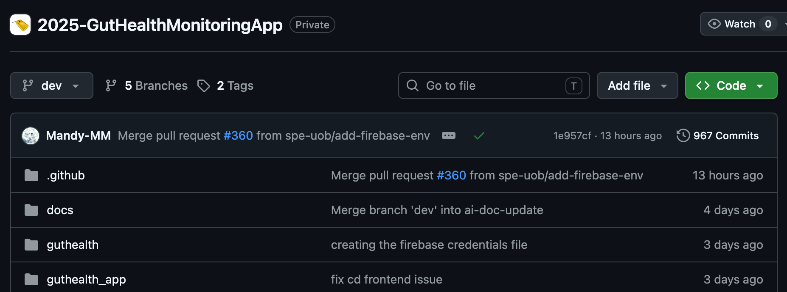

# Installation Guide and User Information

This contains instructions for installing our application.
Currently the application only runs on android architecture.

## Contents

+ [If you are a developer then you can](#if-you-are-a-developer-then-you-can)

+ [If you are not a developer then you should](#if-you-are-not-a-developer-then-you-can)

+ [User Information](#user-information)

## <a id="if-you-are-a-developer-then-you-can"></a>**If you are a developer then you can**

1) Connect your phone to your laptop via a USB cable. 
2) Open project in your preferred IDE and run this

   ``` 
   cd guthealth_app
   flutter install
   ```
3) Disconnect and you'll find the app installed amongst other applications on your device. 


##  <a id="if-you-are-not-a-developer-then-you-can"></a>**If you are not a developer then you should**

1) Follow this link to lead you to the page shown below: 
   
2) Click on the green code button. This should open the following dropdown:
   

3) Select download zip. 
4) Go to your downloads and extract this file (this can differ based on your operating system):

   + **In Macos you can simply double tap on the folder to unzip it.** 
     + This will extract the contents into the current folder your zip file is in.
   
   + **In Windows you'll need to:**
     + Right click the package and click **Extract All**
     + Choose a destination in your laptop to extract the package too.
     
5) **Email yourself the following file:** the `app-release.apk ` 
     + You can find this under the following path:
     ```<your-system-folders-path-here>/2025-GutHealthMonitoringApp/guthealth_app/build/app/outputs/flutter-apk/app-release.apk```
     + Everything that precedes app-release.apk is a folder in the extracted zip file (with the top level folder being 2025GutHealthMonitoringApp

6) Open the email on your phone and download the apk file. 
7) Go to your downloads and click the apk file this should trigger the installation. Follow the instructions on your screen and then your done!

**Once installed you will find this logo amongst your applications :**


## <a id="user-information"></a>**User Information**

### This section exists as a guide to show what parts of the application functions and  to what degree.

Below is a labelled diagram showcasing all the working components of our interface:


 
Below is a labelled diagram showcasing all the components of our interface for which implementation needs to be completed by future developers.


