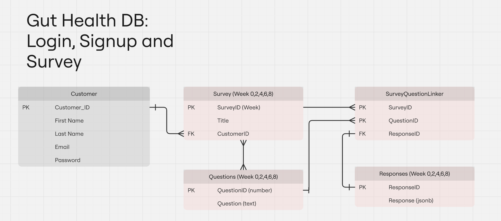

# SEP project team - work management

## Rotating project managers

30/09/25 - 19/10/25: Ananya

20/10/25 - 20/11/25: Niyor

21/11/25 - 19/12/25: Mandy

## Weeks 1 – 3

Start learning and start coding

Rough plans for all components of the app

` `- create basic UI design

` `- Diagrams

` `- Database design

` `- how frontend connects to backend

### Frontend – Flutter

Design UI for the application

Notifications

Buttons and pages

Think about how to connect to backend

Logins - registration

- Niyor
- Mandy

### Backend – Spring boot / Database

- Lingyi
- Ananya

java/Spring boot – fetching and displaying historical data. 

Database -> what entities are needed. 

- Users/customers

## Weeks 4-6

Meeting with client - they told us about connecting logins to their Shopify which we didn't know about before so we lacked in progress due to this and as well as reading week.
We also didn't switch teams as we were still in process of learning flutter, springboot and postgres.

### Frontend - Login and sign up page

 - Login and sign up pages created
 - Not connected to backend
 - UI designs for home and survey page

Niyor, Mandy

 ### Backend - setting up database, dockerising app and initalising java files

  - Springboot app setup on repo
  - setup postgres database
  - dockerise the app

Ananya, Lingyi

## Weeks 6-8

### Frontend - Home and survey page
 - Created home and survey page
 - Home page connected to survey page
 - survey page sends response to backend

Niyor, Mandy

### Backend - Collect frontend response and create database
 - Local database setup
 - data from frontend successfully collected
 - Springboot app successfully launches

Ananya, Lingyi

